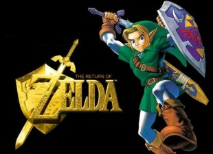
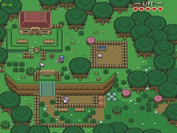
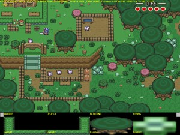

# The Return Of Zelda
My Zelda fan project from 2003.

  

## Controls

```
Up, Down, Left, Right: Move Link
Ctrl: Fight
Shift: Throw object
F4: Show map
ESC: Leave game

Special controls:
F1: Run editor
F2: Save game
F3: Change draw mode (only editor)
F5: Open log window
Del: Delete selected object (only editor)
Home: Log window: go to first line; editor: switch object
End: Log window: go to last line
PgUp: Log window: prior page; editor: increase object level
PgDown: Log window: next page
```

## Compilation under Windows

Open *Zelda.sln* with Microsoft Visual Studio 2013.
